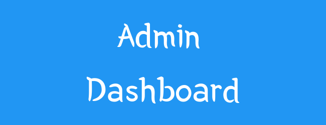
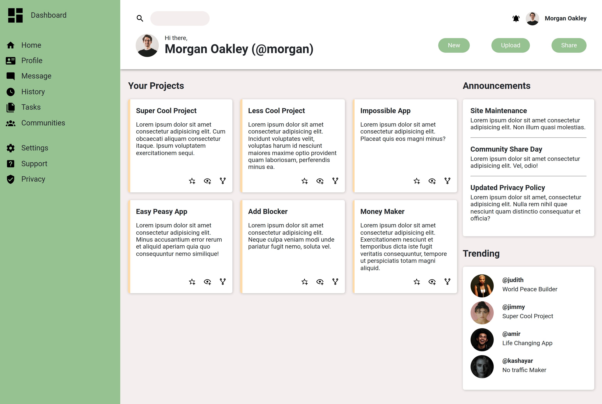

An admin dashboard built using **Flexbox** and **Grid**.

## Overview

For a live preview click [here](https://lindelwa122.github.io/odin-admin-dashboard)

## What I Learned

- Learned how to effectively use **grid** and **flexbox** together to create awesome layouts.
- Learned about `:root`, CSS variables and how to implement dark mode.

## Cool Features

- Hover over the icons, buttons, and input field to see some of the cool effects I added.
- Depending on your OS theme settings the website will appear in dark or light mode.

## Credits

* This [project](https://www.theodinproject.com/lessons/node-path-intermediate-html-and-css-admin-dashboard) is part of the [Odin Project's curriculum](https://www.theodinproject.com).
* The images used were taken from [Unsplash](https://unsplash.com) and the artists are:
    * [Alexander Hipp](https://unsplash.com/@alexanderhipp)
    * [Jimmy Fermin](https:/unsplash.com/@jimmyferminphotography)
    * [Judith Ejike](https://unsplash.com/j@udithwealth)
    * [Amir Seilsepour](https://unsplash.com/@amiresel)
    * [Kashayar Kouchpeydeh](https://unsplash.com/@kouchpeydeh)

## Conclusion

Feel free to star and fork this repository.

Happy Coding!